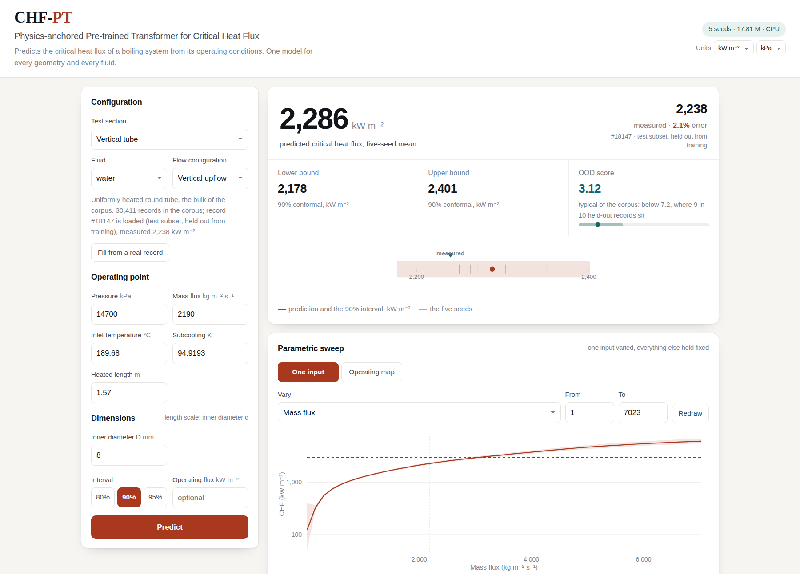

# CHF-PT: A physics-anchored pre-trained Transformer for transferable critical heat flux prediction

CHF-PT predicts the critical heat flux (CHF) of a boiling system from the operating condition and
the geometry of the test section, and returns a CHF estimate, a conformal prediction interval and
an out-of-distribution score. Each data point is represented as a variable-length set of key-value
tokens from a common feature layer and a geometry-specific feature layer, so that test sections
described by different parameters are handled by one model. The learning target is the logarithmic
residual to the closed-form Zuber correlation, which sets the CHF magnitude for any fluid from its
saturation properties. The database released with the model holds 32,271 data points covering
7 fluids, 15 geometries and CHF from 12 to 41,900 kW m⁻². A public instance of the service is available at https://open-nest-entries-commission.trycloudflare.com/ and its source is distributed with the code listed below. 




*The web service in `demo/`, applied to a test data point that was not used in training (measured
CHF 2,238 kW m⁻²): predicted CHF 2,286 kW m⁻², with the 90% conformal interval and the
out-of-distribution score.*

## Database

| | |
|---|---|
| File | `data/CHF_dataset_v1.1.xlsx` |
| Data points | 32,271 from 15 experimental sources |
| Coverage | 7 fluids, 15 geometries, 19 fluid-geometry domains, CHF from 12 to 41,900 kW m⁻², including 12 microgravity data points from the International Space Station |
| Columns | 68: identifier and split, 4 categorical and 27 numeric common features, 24 numeric and 3 categorical geometry-specific features, 3 physics anchors, measured CHF, a data-quality tag and 3 provenance columns |
| Split | 22,600 training / 3,227 validation / 3,225 calibration / 3,219 test (column `split`) |
| Sheets | `CHF_data`, `Dictionary` (definition, unit and coverage of each column), `Sources`, `Domains` |

## Usage

```bash
pip install numpy pandas openpyxl torch
python test/test_chfpt.py                  # evaluate the five trained models on the test split
python train/train_chfpt.py --all_seeds    # train the five models

pip install flask waitress
python demo/server.py --no-tunnel          # web service at http://localhost:5000
```

Python 3.9 or later; a GPU is optional. The trained models are in `model/chfpt/`, evaluation
results are written to `test/results/chfpt/`, and `demo/README.md` describes the web service.
